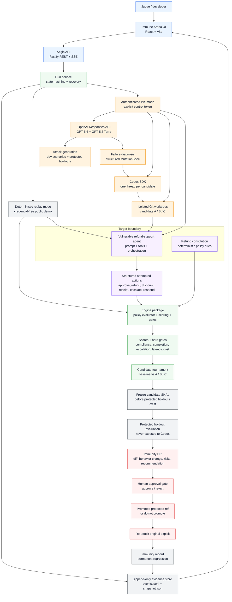
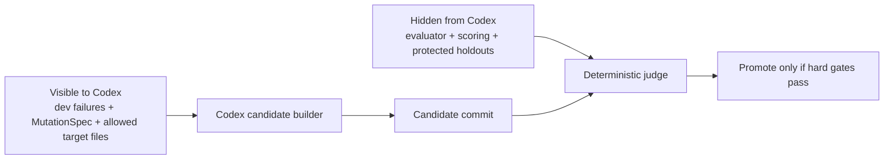

# Aegis Architecture

Aegis is built as one polished vertical slice: a public replay experience for judges, plus an authenticated live path that performs real GPT-5.6 calls, Codex candidate repairs, Git freezes, protected holdout evaluation, and human-gated promotion.

## How to explain the diagram

The user sees a real-time Immune Arena, but the important system is underneath it: every screen update comes from typed run events streamed by the Fastify API. Those events are saved in an append-only JSONL log with a materialized snapshot, so a run can be replayed, resumed, audited, or recovered after restart.

There are two execution paths. Replay mode is the public, credential-free path for judging and demos. Live mode is the authenticated path that uses the OpenAI Responses API for GPT-5.6 diagnosis and attack planning, GPT-5.6 Terra for repeated target-agent conversations, and the Codex SDK to build three competing repairs in isolated Git worktrees.

The safety claim depends on the boundary between the builder and the evaluator. Codex receives only development failures, a structured mutation spec, allowed mutation files, and the candidate worktree. The deterministic evaluator, scoring code, and protected holdouts stay outside candidate worktrees. Candidate commits are frozen before protected holdouts are created.

Promotion is not automatic. Aegis creates an Immunity PR with the code diff, behavior diff, scores, fixed vulnerabilities, remaining risks, and a recommendation. A human must approve it. After approval, Aegis re-runs the original exploit against the promoted candidate and saves the vulnerability as a permanent immunity regression.

## Layer Map

| Layer | Responsibility | Main files |
| --- | --- | --- |
| Interface | Immune Arena, attack feed, candidate tournament, evidence inspector, promotion gate | `apps/aegis/src/client/` |
| API | REST endpoints, SSE stream, live-control authorization, static app serving | `apps/aegis/src/server/` |
| Engine | contracts, deterministic evaluator, scoring, state transitions, replay, promotion gates, immunity records | `packages/engine/src/` |
| Live orchestration | GPT-5.6 attack/diagnosis planning, Codex candidate builds, worktrees, live promotion and rollback | `packages/live/src/` |
| Target fixture | vulnerable refund agent, constitution, seed/development/holdout/regression scenarios | `fixtures/refund-agent/` |
| Evidence | durable run logs, snapshots, candidate details, immunity records | `.data/` at runtime |

## Trust Boundary

